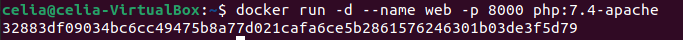
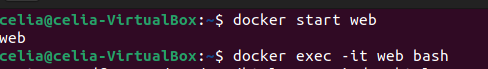
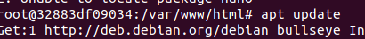
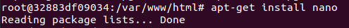
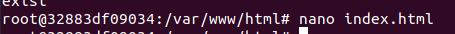
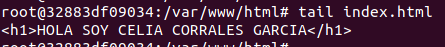
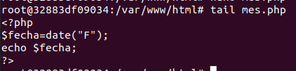
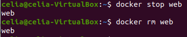

# Ejercicios Docker - entregables

> Trabajo realizado por Celia Corrales García


## Ejercicio - trabajo con imágenes

### Servidor web

1. Arrancar un contenedor que ejecute la imagen php:7.4-apache, llamado web, por el puerto 8000.

   ````bash
   docker run -d --name web -p 8000 php:7.4-apache
   ````
   
   


2. Colocar en el directorio raíz del contenedor un archivo index.html que contenga 'HOLA SOY XXXXX' (nombre y apellidos).

   ````bash
   docker start web
   docker exec -it web bash
   ````
   
   
   
   
   
   

````bash
apt update
apt-get install nano
nano index.html
tail index.html
````










3. Colocar en el mismo directorio otro archivo llamado llamado mes.php que muestre el mes actual, y ver la salida del script en el navegador.

   ````bash
   tail mes.php
   ````

   

   

   
   
   4. Borrar el contenedor.
   
      ````bash
      exit stop web
      docker rm web
      ````



