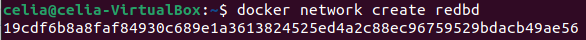
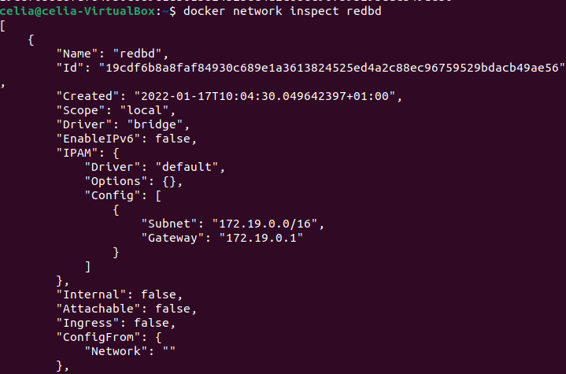
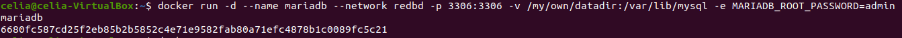
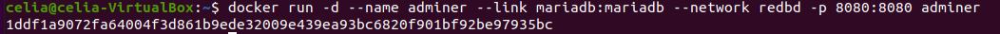
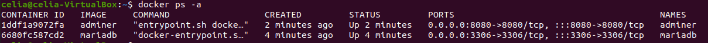
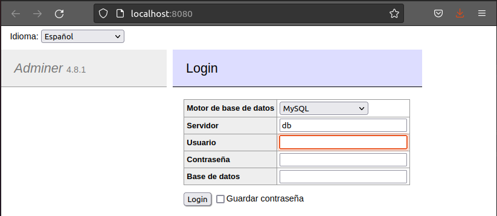
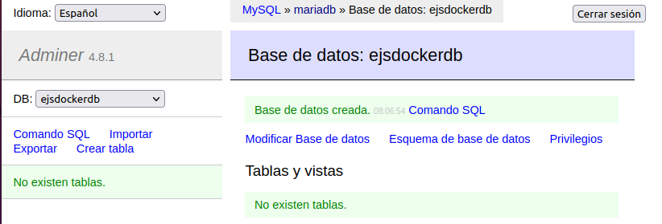
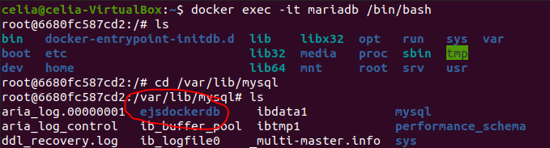
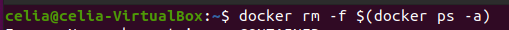

# Ejercicios Docker - entregables

> Trabajo realizado por Celia Corrales García

## Ejercicio - redes

### Despliegue de contenedores en red: Adminer y MariaDB

1. Crea una red bridge redbd

   ````bash
   docker network create redbd
   ````

   

   

   ````bash
   docker network inspect redbd
   ````

   

   

   

2. Crea un contenedor con una imagen de mariaDB dentro de la red, que se ejecutará en segundo plano y será accesible a través del puerto 3306.

   ````bash
   docker run -d --name mariadb --network -p 3306:3306 -v /my/own/datadir:/var/lib/mysql -e MARIADB_ROOT_PASSWORD=admin mariadb
   ````

   

   

3. Crea un contenedor Adminer que se pueda conectar con el contenedor de la BD.

   ````bash
   docker run -d --name adminer --link mariadb:mariadb --network redbd -p 8080:8080 adminer
   docker ps -a
   ````

   

   

   

4. Comprueba que el contenedor Adminer puede conectar con el contendor mysql accediendo a la URL http://localhost:8080



-Pantallazo donde se vea la creación de la base de datos con la interfaz web Adminer




-Pantallazo  donde  se  entre  a  la  consola  del  servidor  web  en  modo  texto  y  se
compruebe que se ha creado la BD:

````bash
docker exec -it mariadb /bin/bash
````





-Pantallazo de borrado de los contenedores la red y los volúmenes utilizados

`````bash
docker rm -f $(docker ps -a)
docker rm -R /my/own/datadir 
`````





